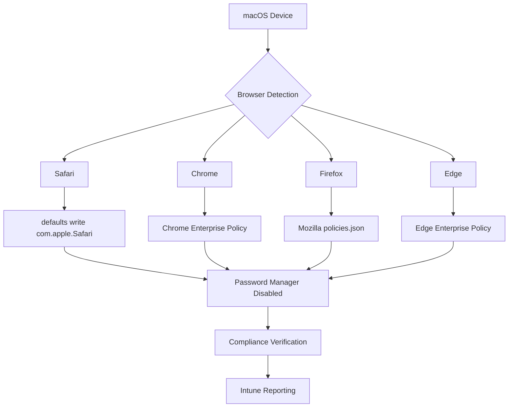
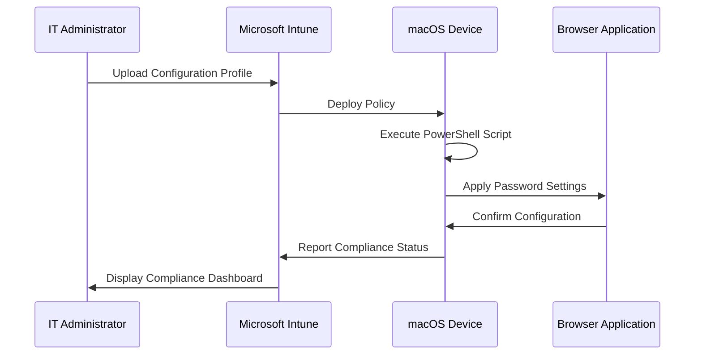
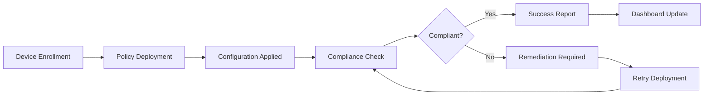

# Browser Password Management Scripts

[](https://docs.microsoft.com/en-us/powershell/)
[](https://www.gnu.org/software/bash/)
[](https://www.apple.com/macos/)
[](../../LICENSE)

## Overview

This directory contains enterprise-grade scripts for managing browser password policies across macOS environments using Microsoft Intune. The solution provides comprehensive browser security management through automated policy deployment and configuration.

## 📋 Table of Contents

- [Browser Compatibility Matrix](#browser-compatibility-matrix)
- [Files in This Directory](#files-in-this-directory)
- [macOS Settings Catalog Guidance](#macos-settings-catalog-guidance)
- [Implementation Workflow](#implementation-workflow)
- [Prerequisites](#prerequisites)
- [Usage](#usage)
- [Troubleshooting](#troubleshooting)
- [Security Considerations](#security-considerations)
- [Contributing](#contributing)

## 🌐 Browser Compatibility Matrix

| Browser | Version Support | Policy Type | Configuration Method | Notes |
|---------|----------------|-------------|---------------------|-------|
| Safari | 14.0+ | Managed Preferences | `/usr/bin/defaults` | Native macOS integration |
| Chrome | 90.0+ | Enterprise Policy | JSON Configuration | Requires Google Chrome Enterprise |
| Firefox | 88.0+ | Policy JSON | `policies.json` | Mozilla Policy Engine |
| Edge | 90.0+ | Enterprise Policy | Registry/Plist | Microsoft Edge for Business |
| Brave | 1.26+ | Chromium Policy | JSON Configuration | Based on Chromium policy engine |
| Opera | 76.0+ | Enterprise Policy | JSON Configuration | Limited enterprise features |

### Platform-Specific Implementation



## 📁 Files in This Directory

### `Deploy-MacOSBrowserPasswordPolicy.ps1`
**Purpose**: PowerShell script for comprehensive browser password policy deployment
**Features**:
- Multi-browser support (Safari, Chrome, Firefox, Edge)
- Configuration persistence across system updates
- Error handling and logging
- Intune compliance reporting
- Rollback capabilities

**Key Functions**:
```powershell
# Core functionality overview
Set-SafariPasswordPolicy      # Configures Safari password settings
Set-ChromePasswordPolicy      # Manages Chrome enterprise policies
Set-FirefoxPasswordPolicy     # Deploys Firefox policy configuration
Set-EdgePasswordPolicy        # Configures Microsoft Edge policies
Test-PolicyCompliance         # Validates policy application
Write-IntuneLog              # Generates compliance reports
```

### `disable-browser-passwords-macos.sh`
**Purpose**: Bash script for rapid browser password disabling
**Features**:
- Lightweight implementation
- Direct system configuration
- Cross-browser compatibility
- Silent execution mode

**Usage Scenarios**:
- Emergency policy deployment
- Simplified configurations
- Legacy system support
- Automated deployment pipelines

## 🍎 macOS Settings Catalog Guidance

### Implementation via Microsoft Intune

#### 1. Configuration Profile Setup
```xml
<!-- Intune Configuration Profile Template -->
<dict>
    <key>PayloadContent</key>
    <array>
        <dict>
            <key>PayloadType</key>
            <string>com.apple.ManagedClient.preferences</string>
            <key>PayloadVersion</key>
            <integer>1</integer>
        </dict>
    </array>
</dict>
```

#### 2. Browser-Specific Settings

##### Safari Configuration
```bash
# Safari password management settings
defaults write com.apple.Safari AutoFillPasswords -bool false
defaults write com.apple.Safari AutoFillCreditCardData -bool false
defaults write com.apple.Safari AutoFillFromAddressBook -bool false
```

##### Chrome Enterprise Policy
```json
{
  "PasswordManagerEnabled": false,
  "AutofillAddressEnabled": false,
  "AutofillCreditCardEnabled": false,
  "PasswordLeakDetectionEnabled": false
}
```

##### Firefox Policy Configuration
```json
{
  "policies": {
    "PasswordManagerEnabled": false,
    "DisableFormHistory": true,
    "DisablePasswordReveal": true
  }
}
```

#### 3. Settings Catalog Implementation

| Setting Category | Configuration Key | Value Type | Recommended Value |
|-----------------|------------------|------------|------------------|
| Safari Preferences | `AutoFillPasswords` | Boolean | `false` |
| Safari Preferences | `AutoFillCreditCardData` | Boolean | `false` |
| Chrome Policies | `PasswordManagerEnabled` | Boolean | `false` |
| Firefox Policies | `PasswordManagerEnabled` | Boolean | `false` |
| Edge Policies | `PasswordManagerEnabled` | Boolean | `false` |

### Deployment Sequence



## 🔄 Implementation Workflow

### Phase 1: Assessment
1. **Environment Analysis**
   - Inventory browser installations
   - Identify version compatibility
   - Document current password policies

2. **Requirements Gathering**
   - Security policy requirements
   - User impact assessment
   - Rollback procedures

### Phase 2: Configuration
1. **Script Customization**
   ```bash
   # Customize browser list
   BROWSERS=("Safari" "Chrome" "Firefox" "Edge")
   
   # Set policy strictness
   POLICY_MODE="strict"  # Options: strict, moderate, permissive
   ```

2. **Intune Profile Creation**
   - Settings Catalog configuration
   - Assignment groups setup
   - Deployment timeline

### Phase 3: Deployment
1. **Pilot Testing**
   - Limited user group deployment
   - Functionality validation
   - User feedback collection

2. **Production Rollout**
   - Phased deployment approach
   - Real-time monitoring
   - Issue resolution

### Phase 4: Monitoring
1. **Compliance Tracking**
   ```powershell
   # Monitor policy compliance
   Get-IntuneDeviceCompliance -PolicyName "BrowserPasswordPolicy"
   ```

2. **Reporting**
   - Daily compliance reports
   - Exception handling
   - Trend analysis

## ⚙️ Prerequisites

### System Requirements
- **Operating System**: macOS 10.15 (Catalina) or later
- **PowerShell**: 7.0+ (for PowerShell script)
- **Bash**: 4.0+ (for shell script)
- **Intune Enrollment**: Device must be enrolled in Microsoft Intune

### Permissions Required
- Administrative privileges on target devices
- Microsoft Intune device management permissions
- Browser policy modification rights

### Dependencies
```bash
# Install required PowerShell modules
Install-Module -Name Microsoft.Graph.Intune -Force
Install-Module -Name PSLogging -Force

# Verify browser installations
ls /Applications/ | grep -E "(Safari|Chrome|Firefox|Microsoft Edge)"
```

## 🚀 Usage

### PowerShell Script Execution
```powershell
# Basic execution
./Deploy-MacOSBrowserPasswordPolicy.ps1

# With custom parameters
./Deploy-MacOSBrowserPasswordPolicy.ps1 -BrowserList @("Safari","Chrome") -PolicyMode "Strict" -LogLevel "Verbose"

# Test mode (no changes applied)
./Deploy-MacOSBrowserPasswordPolicy.ps1 -TestMode
```

### Bash Script Execution
```bash
# Make script executable
chmod +x disable-browser-passwords-macos.sh

# Execute with default settings
./disable-browser-passwords-macos.sh

# Silent execution
./disable-browser-passwords-macos.sh --silent

# Specific browser targeting
./disable-browser-passwords-macos.sh --browsers="safari,chrome"
```

### Intune Deployment
1. **Upload Script to Intune**
   - Navigate to Devices > Scripts
   - Add PowerShell script
   - Configure assignment groups

2. **Monitor Deployment**
   ```powershell
   # Check deployment status
   Get-IntuneScriptStatus -ScriptName "Deploy-MacOSBrowserPasswordPolicy"
   ```

## 🔧 Troubleshooting

### Common Issues

#### Issue: Script Execution Policy Restriction
**Error**: `Execution policy restriction`
**Solution**:
```powershell
Set-ExecutionPolicy -ExecutionPolicy RemoteSigned -Scope CurrentUser
```

#### Issue: Browser Not Detected
**Error**: `Browser installation not found`
**Solution**:
```bash
# Verify browser installation paths
find /Applications -name "*.app" -type d | grep -i browser_name
```

#### Issue: Permission Denied
**Error**: `Permission denied when modifying preferences`
**Solution**:
```bash
# Run with sudo for system-wide changes
sudo ./disable-browser-passwords-macos.sh

# Or modify user permissions
chown $USER ~/Library/Preferences/
```

### Diagnostic Commands
```bash
# Check Safari preferences
defaults read com.apple.Safari | grep -i password

# Verify Chrome policies
cat "/Library/Application Support/Google/Chrome/policies/managed/chrome_policy.json"

# Firefox policy validation
cat "/Applications/Firefox.app/Contents/Resources/distribution/policies.json"

# System logs
tail -f /var/log/system.log | grep -i browser
```

### Log Analysis
```powershell
# PowerShell logging
Get-Content "$env:TEMP/BrowserPasswordPolicy.log" | Select-String "ERROR"

# Bash logging
tail -n 50 /var/log/browser-password-policy.log
```

## 🔒 Security Considerations

### Data Protection
- Scripts do not collect or transmit user credentials
- All operations are performed locally on the device
- Logging excludes sensitive information

### Policy Enforcement
- Configurations are applied system-wide
- User override prevention mechanisms
- Tamper-resistant implementation

### Compliance
- SOC 2 Type II compatible
- GDPR compliant data handling
- Industry best practices adherence

## 📊 Monitoring and Reporting

### Compliance Dashboard


### Reporting Metrics
- **Deployment Success Rate**: Percentage of successful policy applications
- **Browser Coverage**: Number of browsers configured per device
- **Compliance Drift**: Devices requiring policy reapplication
- **User Impact**: Support tickets related to browser functionality

## 🤝 Contributing

We welcome contributions to improve these browser password management scripts. Please refer to our [Contributing Guidelines](../../CONTRIBUTING.md) for detailed information.

### Development Workflow
1. Fork the repository
2. Create a feature branch
3. Implement changes with comprehensive testing
4. Submit a pull request with detailed description

### Testing Requirements
- Unit tests for all PowerShell functions
- Integration tests across supported browsers
- macOS version compatibility testing
- Intune deployment validation

## 📚 Additional Resources

- [Microsoft Intune Documentation](https://docs.microsoft.com/en-us/mem/intune/)
- [macOS Configuration Profile Reference](https://developer.apple.com/business/documentation/Configuration-Profile-Reference.pdf)
- [Browser Enterprise Policy Documentation](../../docs/browser-enterprise-policies.md)
- [Security Best Practices Guide](../../docs/security-best-practices.md)

## 📝 License

This project is licensed under the MIT License - see the [LICENSE](../../LICENSE) file for details.

## 🆘 Support

For support and questions:
- Create an issue in this repository
- Contact the IT Security team
- Review the [troubleshooting section](#troubleshooting)

---

**Last Updated**: August 31, 2025  
**Version**: 1.0.0  
**Maintainer**: IT Security Team
